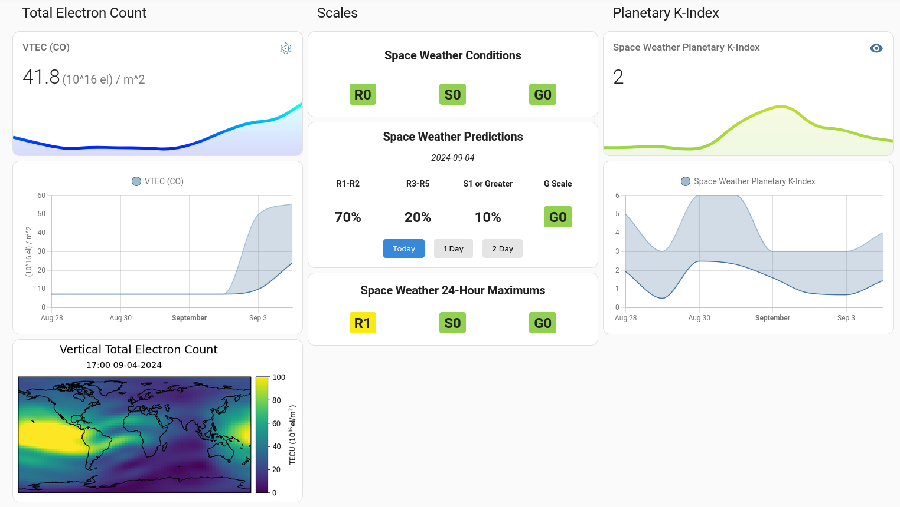

# ha-noaa-space-weather

*NOAA space weather data in Home Assistant.*

This project consists of an external MQTT feeder, a custom component, and custom dashboard cards.

Works well with [tcarwash/home-assistant_noaa-space-weather](https://github.com/tcarwash/home-assistant_noaa-space-weather). Both this and `tcarwash/home-assistant_noaa-space-weather` both provide Planetary K-Index, but ours is updated every 5 minutes. SWPC publishes new data every 1 minute.

Individual components have their own README files.
 
  

